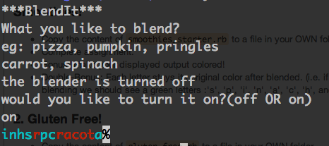

### Smoothies!

- Copy the content of `ruby_blendr_app` to a file in your own Workspace folder
- Look in smoothies_starter for instructions
- Complete assignment.

---

### Bonus

- Bonus: Make your displayed output colored! Include colors using the `rainbow` gem
- Double-Bonus: Each letter stays its original color after blended.  (i.e. if 'carrots' is colored red, and 'spinach' is colored blue, the resulting output should look like this:

