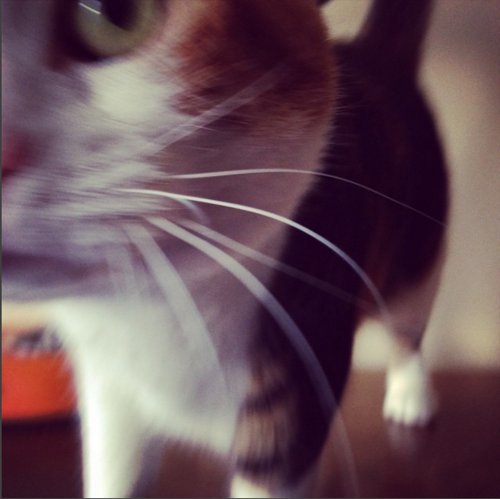

# HappiTails

##### WORK WITH YOUR PARTNER:

###### You are the managers at HappiTails animal shelter. You need to manage your shelter by storing and manipulating information about clients and animals.

- Define the animal, client and shelter classes according to the specs. Each class should have the appropriate attributes and initialize method.
- Run the tests to make sure the following specifications pass.

---

### Specifications:

##### Object Specs:

- Animal:
  - An animal should have a name.
  - An animal should have an age.
  - An animal should have a species.
  - An animal can have multiple toys, but doesn't start with any.
- Client:
  - A client should have a name.
  - A client should have an age.
  - A client can have multiple pets (animals), but it doesn't start with any.
    - Pet names MUST be unique (What implications does this have for our choice of data structure?)
  - A client should be able to accept a pet
  - A client shoule be able to give away a pet

- Shelter:
  - A shelter should have a name
  - A shelter can have multiple animals, but it doesn't start with any.
    - Animal names MUST be unique
  - A shelter can have multiple clients, but it doesn't start with any.
    - Client names MUST be unique
  - A shelter should be able to display all of its clients.
  - A shelter should be able to display all of its animals.
  - A shelter should be able to give away an animal.
  - A shelter should be able to accept an animal
  - A shelter should be able to accept a client

### How to run the tests...

- `$ cd` into the `spec_new` folder
  
- from the command line call rspec command on each spec file
  
- Ex: `$ rspec animal_spec.rb`
  
  > DO NOT EDIT THE SPEC FILES !!!
  
  ​

### MAKE ALL THE TESTS PASS AND YOU ARE DONE!

### HappiTrails!

