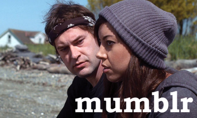
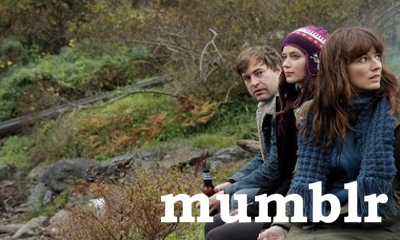
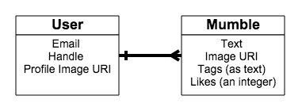
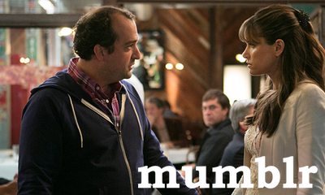
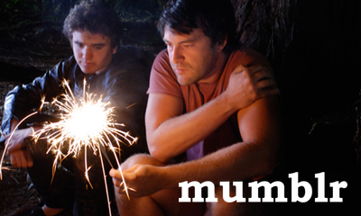
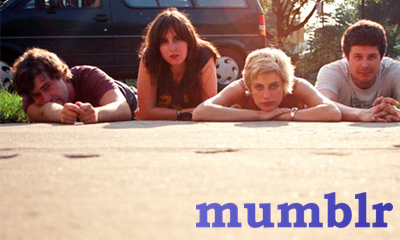
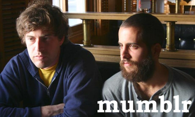
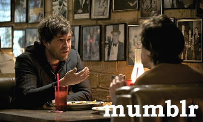
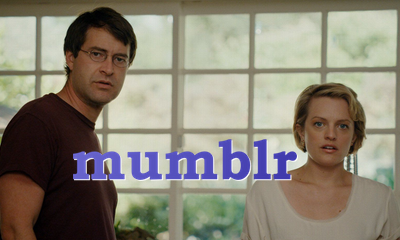

# Mumblr

> so, like, are you in to *of montreal*? i saw them at a   
> 
> really small venue in madison back in the early aughts…

So far we have learned to create, index and show resources using a 

RESTful web interface with Rails. We've also been introduced to 

**basic user auth** (authentication/authorization).

Tonight we are going to use those pieces to build a simple, 

**authenticated microblog**. A microblog is a web application or 

platform that allows very simple messages to be posted and shared 

(think [Twitter][tw], [Tumblr][tm] or [微博][wb]).

## Setup

**Work outside of the class repo!**

Create a new Rails app named `mumblr` or `mumbler`, whichever you'll

remember. Use the class's guides:

- **[Rails Starter guide.][rail-cs]**
- **[Sessions cheatsheet.][sess-cs]**
- (optional) **[Bootstrap guide.][boot-cs]**
- **[REST cheatsheet.][rest-cs]**

**Please finish through Part Three at least.** If you find yourself stuck, you can instead work on

any of the labs or after-hours assignments from this week.

As always: more is better; healthy living is best. Only do the bonus if 

you have completed every single part.

---

### Part 0: Create the App and Generate Models

> so um... uh... whaddoyou guys think of life?..   
> 
> like, it's really, um... hard? right?...

Our microblog is for young, hip people, who aren't sure what to do with

their lives. People too cool to write a lot or speak clearly. God

forbid they use correct spelling. Each of their posts is called a 

`mumble`.

Therefore the two resources our website works with are `users` and

`mumbles`. The ERD looks like:

We also know how to [add validations to our models][ar-val], and how to 

[set default values in our ActiveRecord migrations][ar-mig]. Make sure 

that your models ensure these rules when saving:

- `User`: `email` must exist
  
- `User`: `handle` should default to "anonymous"
  
- `User`: `profile_image_uri`, if not given, defaults to an [anonymous
  
   profile image](assets/default-profile-image.jpg)
  
- `Mumble`: `likes` defaults to zero

---

### Part 1: Seed and Test the Models

> i know we've been together for 10 years, but i just   
> 
> don't feel ready for this level of commitment.

Included with this README is some starter code, [including a database

seed file](starter/seeds.rb). You will know that you've created your

migrations and models correctly when you:

1. copy the seed file into Rails and
2. run it with `rake db:seed` *without errors*.

Make sure to check:

- all of the tables and columns (the class and attributes) are named
  
  the same everywhere (including whether they are singular or plural),
  
- the migrations set defaults correctly,
  
- the migrations have run without error,
  
- the [migrations have set up relationships][ar-ref],
  
- the [**models** have set up their associations (ie, relationships)][ar-ass].

---

### Part 2: Add Root Route and User CRUD

> remember how, like, when we were kids, that like cartoons   
> 
> were *really cartoons*? i miss that…

First: **implement a user index (list of all of the users) to

check that the users you seeded now exist.**

Then, **implement the following _user stories_**:

1. As a visitor, I can visit a home page.
   
2. As a visitor, I see a button or link on the home page called
   
   "Register a new account" that takes me to a form where I can
   
   sign up as a user.
   
3. As a visitor, when I submit the "new account" form, I visit
   
   my own home page with my personal profile.

> What are the RESTful routes for the above?
> 
> It's not obvious!

Hint: make sure you implement the above stories as the routes: 

- `GET  /`          → `welcome#index`
- `GET  /users/new` → `users#new`
- `POST /users`     → `users#create`
- `GET  /users/:id` → `users#show`

---

### Part 3: Add User Auth and Sessions

> what should we do with our lives? i mean, like, hasn't  
> 
> everyone already done everything?

**Implement the following _user stories_**:

1. As a user, when I can visit a home page, I see a button or link on 
   
   the home page called "Log in to account" that takes me to a form 
   
   where I can enter my email and password.
   
2. As a user, when I submit the "log in" form, I visit my own home page
   
   with my personal profile.
   
3. As a user, my personal profile page is only visitable by me. No one
   
   else can visit it.
   
4. As a "logged in" user I see a button or link called "Log out of 
   
   account."
   
5. As a "logged in" user I see a button or link called "Profile" that
   
   takes me to my personal profile page.
   
6. As a "logged in" user, when I click on the "log out" link, I am
   
   "logged out" and return to the home page.

> What are the RESTful routes for the above?
> 
> It's not obvious!

Hint 1: make sure you implement the above stories as the routes: 

- `GET    /session/new` *or …*
- `GET    /login`     → `sessions#new`
- `POST   /sessions`   → `sessions#create`
- `DELETE /sessions` *or …*
- `DELETE /logout`    → `sessions#destroy`
- `GET    /users/:id` → `users#show`

Hint 2: you need to update your migration and model to use basic,

hand-rolled, BCrypt-powered auth with `has_secure_password`.

Hint 3: you need to add some general session-awareness to your 

`ApplicationController`, as well as to your user's controller (for

registering, authenticting and authorizing profiles, etc.)

Hint 4: you need to check who the *current user* is when you visit

a profile page (`users#show`).

---

### Part 4: Add Mumble CRUD

> i feel like maybe i should just double-down on this 
> 
> screenplay…

**Implement the following _user stories_**:

1. As a user, when I am on my profile page, I see a list of my last
   
   ten (or fewer) "mumbles."
   
2. As a user, when I am on my profile page, I see a form to create
   
   a new "mumble."
   
3. As a user, from my profile page I can visit the site's home page.
   
4. As a user, when I visit the site's home page, I see a list of all
   
   users' mumbles in chronological order.

Hint 1: since your `user#show` (profile) page is now *also acting as a new

mumble form*, you don't need a `mumble#new` route.

Hint 2: even though your root route is now *also acting as a mumble 

index*, or list of all the mumbles, you **should** have a `mumble#index`

route anyway! It's your `welcome#index` that is no longer necessary.

Update your `/config/routes.rb` file to direct the root route to the

correct handler.

---

### Part 5: Use [Gravatar][grav-doc] to Insert Smart Defaults

> so the script thing didn't work out, but i'm feeling  
> 
> good about my pilot!

Use the [Gravtastic gem][grav-gem] to help you to check and see if, 

**given an email**, we can set a user's profile image and handle to 

their universal, cross-site preference!

- `User#handle` from Gravatar's `prefferedUsername`
- `User#profile_image_uri` from Gravatar's `thumbnailUrl`

If they did not enter either of these fields, and do not have a Gravatar, 

then they should fall back to the above defaults.

---

### Part 6: HTML &amp; CSS with Bootstrap and Sass

Attempt to create a tiled-image style, as seen below:

---

## Bonus

> We've really grown up, haven't we Elizabeth Moss?

1. When there is missing form data, instead of just redirecting to the form
   
   again, display appropriate error messages.
   
2. Allow people to "like" mumbles.

<!-- LINKS -->

[tw]: https://twitter.com/?lang=en
[tm]: https://www.tumblr.com/explore/trending
[wb]: http://weibo.com/login?lang=en-us
[rail-cs]: /resources/cheatsheets/rails_starter.md
[boot-cs]: /resources/cheatsheets/bootstrap_cheatsheet.md
[rest-cs]: /resources/cheatsheets/rails_rest_cheatsheet.md
[sess-cs]: /resources/cheatsheets/sessions.md
[ar-val]: http://edgeguides.rubyonrails.org/active_record_validations.html#presence
[ar-mig]: http://edgeguides.rubyonrails.org/active_record_migrations.html#column-modifiers
[ar-ref]: http://stackoverflow.com/questions/22815009/add-a-reference-column-migration-in-rails-4
[ar-ass]: http://edgeguides.rubyonrails.org/association_basics.html
[grav-doc]: https://en.gravatar.com/
[grav-gem]: http://guides.railsgirls.com/gravatar/
