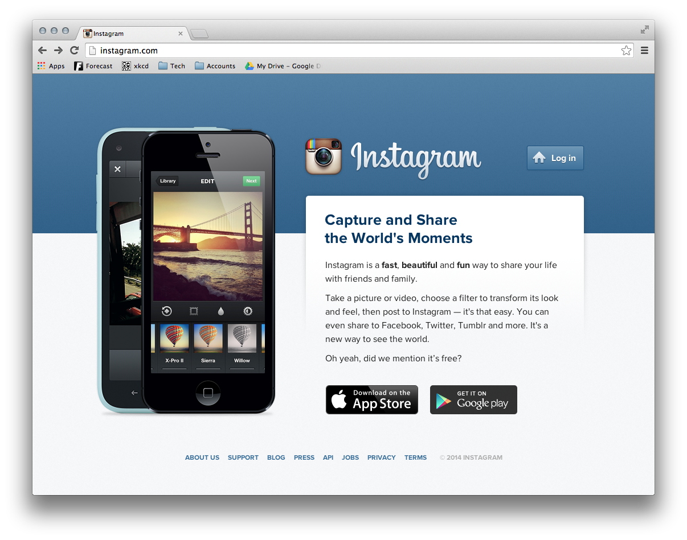

# Instagram Markup

The above image is of the Instagram website's home page (c. early 2015). We are 

going to make a mock-up of it!

## Part 1 - HTML

**Do not look at the file `index-complete.html` just yet!** Instead, attempt to 

take the content in [`index.html`](index.html) and add to it the necessary HTML 

framework to apply the styles.

When you are done, check what you wrote against the `index-complete.html`. It's

not a solution, in that you answer this multiple ways! However, it is going to 

be the HTML used in the *provided* solution.

## Part 2 - Styling

The final version we want to create will look like the below image:

Go to the "raw" version of the file (by clicking on it, and then clicking on 

"Raw") to get it full-sized.

All of the necessary assets are included in the `/images` folder. Use the 

version of the HTML in `index-complete.html` if you were unable to create a 

better version in Part 1!