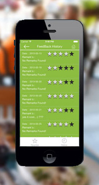

### Lunch Bot (revisited)


- Create an Ionic app called `lunch_bot`
  
- Create a new collection called `lunch_spots` that will hold data about our lunch spots
  
  ``` 
  - Each lunch_spot object should include:
  	- name as string
  	- rating as number
  ```
  
- Populate your collection with at least three lunch spots
  
- Create a custom index view page that will display the your lunch spots and their ratings

> example

 


#### Bonus

- create a `show` view for each lunch spot and route back and forth between the two (include more information with your restaurants like image urls and popular menu items)
- add a button that randomly picks a lunch spot for you and your WDI mates to go to
- create a form to add new lunch spots